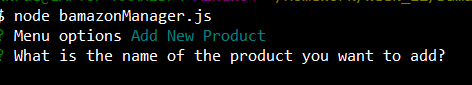

# Bamazon

## Overview

This is an Amazon-like storefront utilizing node and MySQL database. The app is a CLI (command-line interface).  It presents two views.
*  The customer view that will take in orders from customers and deplete stock from the store's inventory.  It notifies the customer of either insufficient stock levels or a order total based on quantity purchased and item price.
*  The manager view allows the manager to view all stock, view low quantity stock, add product to current stock levels, and add new products to the database.

The app requires MySQL, Inquirer, and Num-ber npm packages.

If you want to view the video tutorial, please visit <a href="https://youtu.be/VSXz0Azv-u4" target="_blank">YouTube</a>.

## Database Setup and Population

*  Setup

This is the coding for the setup of the database in MySQL:

This is the success of the setup of the database.

*  Data Population

This is the coding for the initial data population of the database in MySQL:

This is the success data population of the database in MySQL:

## Customer View

### The entry point is bamazonCustomer.js from the node command line.

*  Starting the app from the command line.

*  Customer is prompted to enter a selection from the list of inventory items that they wish to purchase.

*  Customer is then shown the item selected and is prompted for the quantity they wish to purchase.

*  The requested quantity is compared to the stock level on-hand.  If sufficient stock, the customer is given the order total and prompted if they wish to shop again. The order total is calculated by multiplying the unit price of the item by the quantity requested.

The stock levels are updated.  Below are before and after stock levels for the order.

  **Before**

  **After**

*  If the stock levels are insufficient, the customer is notified that the order was unable to be fulfilled and they are asked if they wish to shop again. 

*Note the image of inventory in 4 shows that quantities were not sufficient.*

*  If the customer chooses to not shop again, they are displayed the message to please come again.

## Manager View

### The entry point is bamazonManager.js from the node command line.

*  Starting the app from the command line.

*  The manager is given four options.

  * Option 1: View Products for Sale. This displays all items in inventory with a quantity greater than zero.  

  * Option 2: View Products with Low Inventory. This displays all items with quantities below 5.

  * Option 3: Add to Inventory. This displays all items listed in the database. It prompts the manager to select the item they wish to add stock levels.

  Manager is then prompted for quantity to add.  The app adds the inventory to the current inventory levels.

  Below are screenshots of the inventory before and after the inventory stock addition.

  **Before**

  **After**

  The manager is then displayed that the product was successfully updated.

  * Option 4: Add New Inventory.  Manager is prompted for the name of the product.

  The manager is prompted to enter in a department name for the product.

  The manager is prompted to enter in a sales price.

  The manager is prompted to enter a quantity.

  The manager is then displayed that the product was successfully added to the database.

  Below are screenshots of the inventory before and after the new product is added.

  **Before**

  **After**

